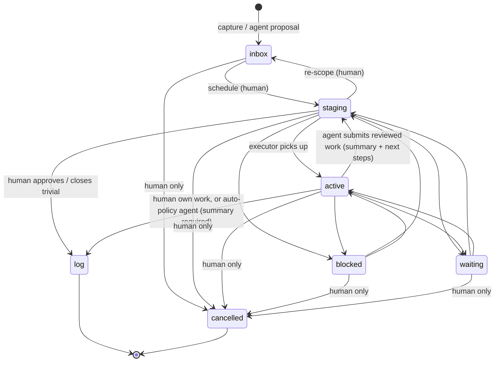

# State Machine

Status: implemented. The board is a shared task manager for one human and their agent(s). This doc formalizes the states, transitions, and — the core contract — who is allowed to trigger each transition. Rules are keyed off two authenticated facts: the **actor type** of the caller and the **executor** of the card. This is the contract the API enforces.

## Mental model

The state names map to how working memory actually operates:

- **Inbox** = storage — captured ideas, future-dated work, the parking lot
- **Staging** = short-term memory (today's list) — promoted from Inbox for this work session
- **Active** = CPU — one card per executor at a time, currently being worked
- **Log** = history — completed and cancelled work reviewed daily/weekly/quarterly

## Actors

| Actor | Definition |
|---|---|
| **Human** | Any client authenticated as a human user. |
| **Agent** | Any client authenticated as an automated agent (LLM-driven or scripted). |
| **System** | The board itself, acting without a caller (e.g. a scheduled promotion). |

An actor is identified by its auth credential, not by claimed identity in the request body.

## Executor: who is doing this card

Every card has an **executor**: `human`, `agent`, or `unassigned`. This is a first-class field, not a label, because most transition rules depend on it.

- **Executor assignment is the human's act.** An agent may volunteer via annotation but never assign work to itself or shed work it was given.
- **Agents may only transition cards they execute.** On all other cards, an agent is read-and-annotate only.
- **Human-executed cards have no review gate.** The human closes their own work freely.
- **Agent-executed cards gate through Staging.** A completed reviewed-policy card routes to Staging for the human to approve before going to Log. The human closes it from there.

## Review policy

- **`reviewed`** (default): agent-completed work routes to Staging for human approval.
- **`auto`**: the agent may close the card `active → log` directly, still with a required summary.

Auto is the human's amortized review: they approve the task definition once, every run inherits the policy. An agent may always escalate an `auto` card into Staging review.

## States

| State | Meaning | Terminal? |
|---|---|---|
| **inbox** | Captured, not yet scheduled. Includes future-dated cards (`scheduledFor` field). | No |
| **staging** | Today's list — promoted from Inbox. Also holds agent-completed work awaiting human review. | No |
| **active** | Being worked right now. One card per executor (409 if already occupied). | No |
| **log** | Completed and processed history. | Yes |
| **blocked** | Stalled; something must change. Requires a note saying what is needed (agent) or what's blocking (human). | No |
| **waiting** | Paused for a time or external event; expected to resume. | No |
| **cancelled** | Withdrawn. | Yes |

## Transitions

### Main flow

| From | To | Who | Note required? |
|---|---|---|---|
| *(none)* | inbox | Human, Agent | — |
| inbox | staging | **Human only** (schedule into today's list) | No |
| staging | active | **Executor only** (picks up their own staged work) | No |
| staging | active | **Human** (sends agent-completed work back for rework) | Yes |
| staging | log | **Human only** (approve agent work, or close trivial human work) | No |
| staging | inbox | **Human only** (re-scope) | Yes |
| active | log | Human (human-executed cards) | No |
| active | log | Agent (`auto` policy only, summary required) | Yes |
| active | staging | Agent (routes reviewed work for human approval, note = summary + next steps) | Yes |

### Pause / resume

| From | To | Who |
|---|---|---|
| staging, active | blocked | Executor or Human (agent must note what is needed) |
| staging, active | waiting | Executor, Human, or System |
| blocked, waiting | *(pausedFrom state)* | Executor, Human (System for waiting only) |

### Cancellation

Any non-terminal state → `cancelled`: human-only.

## Single-occupancy on Active

The API returns **409 Conflict** if the executor already has a card in `active` when another tries to move there. Finish or pause the current card first.

## Scheduled promotion

Cards in `inbox` with a `scheduledFor` date ≤ today are automatically promoted to `staging` by the system (via `POST /system/promote-scheduled` or on a cron schedule). Setting the `scheduledFor` date is human-only.

## Two tracks, one Staging

Human and agent work share the `staging` state, differentiated by the `executor` field:

- `staging + executor=human` — the human's today list
- `staging + executor=agent` — agent work ready to start, OR agent-completed work awaiting review

The board UI displays these in separate columns. The state machine enforces the right actions on each.

## Flow

```
Human:  inbox ──► staging ──► active ──────────────► log
                                                      ▲
Agent:  inbox ──► staging ──► active ──► staging ────┘
                              (agent submits for review)
```

## Shutdown Protocol

Daily end-of-session ritual:

1. Review today's Log
2. Add new items to Inbox
3. Clear agent active/staging cards → move to Log or back to appropriate Inbox
4. Optionally: agent posts a daily summary annotation

## Progress notes and annotations

1. **Any actor may annotate any card, any time.** Progress notes, questions, suggestions, volunteering.
2. **An agent transitioning into a human-attention state requires a note.** Entering `staging` (review submission) requires a summary + suggested next steps; entering `blocked` requires what is needed to unblock.

## Decomposition

Complex cards break into child cards (each with its own state, executor, and audit history). Not yet implemented — tracked in `docs/roadmap.md`.

## Diagram



## Audit trail

Every transition is an event (append-only `events` table). Each event records:

- `card_id`, `from` / `to` state, `actor_id` / `actor_type`, `executor`, `review_policy`, `timestamp`, `note`

Executor changes, review-policy changes, label changes, scheduled-date changes, and annotations are also events. The current state of a card is a projection of its event history.

## Open questions

- Does a parent card auto-advance when all children are terminal, or just surface as "reviewable"?
- What guardrails accompany `auto` beyond the audit trail — side-effect budget, spot-check digest, auto-demotion after N failures?
- Is there a path back out of `log` (reopening)? Currently a true terminal state.
- Can an agent cancel a card it executes when it determines the task is obsolete, or is `cancelled` strictly human-only as drafted?
- Human-only triage friction: alternative where an agent may schedule cards *it created* into Staging with executor pre-set to itself, subject to a human veto window.
